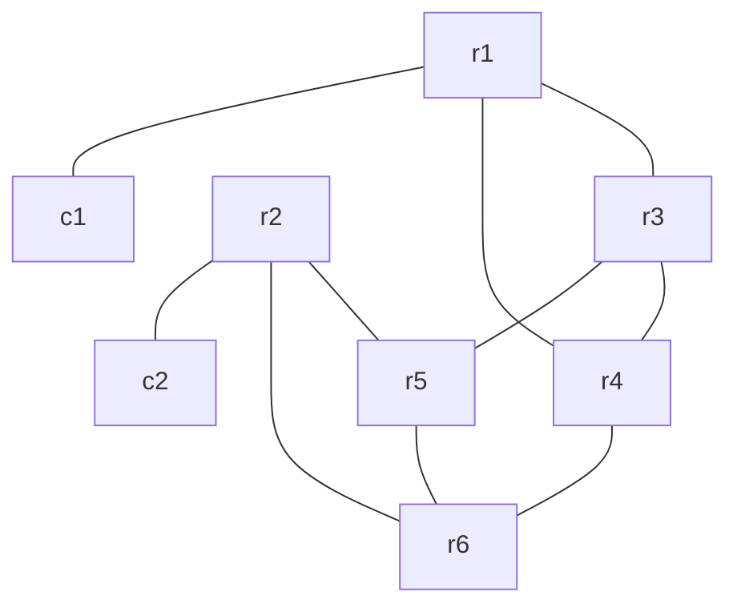

# clab-frr-srv6

## Overview

A Segment Routing IPv6 (SRv6) network using [CONTAINERlab](https://containerlab.dev/) and [FRRouting (FRR)](https://frrouting.org/) nodes to demonstrate SRv6 capabilities in a controlled lab environment. This lab provides a practical environment for learning and testing basic SRv6 concepts, including locator blocks, functions, and behaviors.

## Requirements

- [CONTAINERlab](https://containerlab.dev/install/)
  - _The [CONTAINERlab](https://containerlab.dev/install/) installation guide outlines various installation methods. This lab assumes all [pre-requisites](https://containerlab.dev/install/#pre-requisites) (including Docker) are met and CONTAINERlab is installed via the [install script](https://containerlab.dev/install/#install-script)._
- Docker FRR image: `quay.io/frrouting/frr:master`
- Docker Network Multitool image: `wbitt/network-multitool:alpine-extra` (for client nodes)

## Topology



## Network Resources

- The IPv4 loopback addresses of nodes r1 to r6 follow the format:
  - x.x.x.x/32 for router rx (e.g., 1.1.1.1/32 for r1)
- The IPv6 loopback addresses follow two formats:
  - 2001:c0de:2::x/128 for router rx (e.g., 2001:c0de:2::1/128 for r1)
  - 2001:db8:x::1/128 for SRv6 locator on router rx (e.g., 2001:db8:1::1/128 for r1)
- The interface addresses are IPv6 and follow the format:
  - 2001:c0de:1:y::z/64 where y and z vary per link
- All routers are part of ISIS Level 2 with IS-IS NET addresses following the format 49.0001.0000.0000.000x.00
- BGP is configured with ASN 65000
- SRv6 is configured with:
  - Locator blocks using 2001:db8:x::/48 prefix
  - USID format (micro-segment) with block-len 32, node-len 16, func-bits 16

### Management Network

The following IP addresses are assigned to the containerLAB nodes for management:

| Node | Management IP   |
|------|----------------|
| r1   | 172.28.1.2/24  |
| r2   | 172.28.1.3/24  |
| r3   | 172.28.1.4/24  |
| r4   | 172.28.1.5/24  |
| r5   | 172.28.1.6/24  |
| r6   | 172.28.1.7/24  |
| c1   | 172.28.1.8/24  |
| c2   | 172.28.1.9/24  |

## Deployment

Clone this repository and start the lab:

```shell
git clone https://github.com/dbono711/clab-frr-srv6.git
cd clab-frr-srv6
clab deploy -t lab.yml
```

**_NOTE: CONTAINERlab requires SUDO privileges in order to execute_**

The deployment process:

- Creates the [CONTAINERlab network](lab.yml) based on the topology definition
- Applies the FRR configuration files from the respective router folders on each node
- Executes the initialization scripts for each router and client

## Accessing the Container Shell

The container shell can be accessed by using the `docker exec` command, as follows:

```shell
docker exec -it <container> bash
```

For example, to access the shell on the `r1` FRR container:

```shell
docker exec -it clab-frr-srv6-r1 bash
```

## Accessing the FRR CLI (vtysh)

The FRR CLI can be accessed by using the `docker exec` command, as follows:

```shell
docker exec -it <container> vtysh
```

For example, to access the FRR CLI on the `r1` container:

```shell
docker exec -it clab-frr-srv6-r1 vtysh
```

## Capturing Packets

Here is an example on how to capture packets directly on the host which CONTAINERlab is running:

```shell
sudo ip netns exec clab-frr-srv6-r1 tcpdump -nni eth1
```

## Cleanup

Stop the lab and tear down the CONTAINERlab containers:

```shell
clab destroy -t lab.yml
```

## SRv6 Features Demonstrated

This lab demonstrates several SRv6 features:

1. **SRv6 Locators**: Each router has a unique locator block (2001:db8:x::/48)
2. **Micro-segment (uSID)**: Using the format with block-len 32, node-len 16, func-bits 16
3. **ISIS-SR**: Integration of Segment Routing with IS-IS protocol
4. **BGP over SRv6**: BGP peering using SRv6 for transport
5. **L3VPN over SRv6**: BGP peering using SRv6 for transport

## Author

- Darren Bono - [darren.bono@att.net](mailto://darren.bono@att.net)

## License

This project is licensed under the MIT License. See [LICENSE](LICENSE) for details
