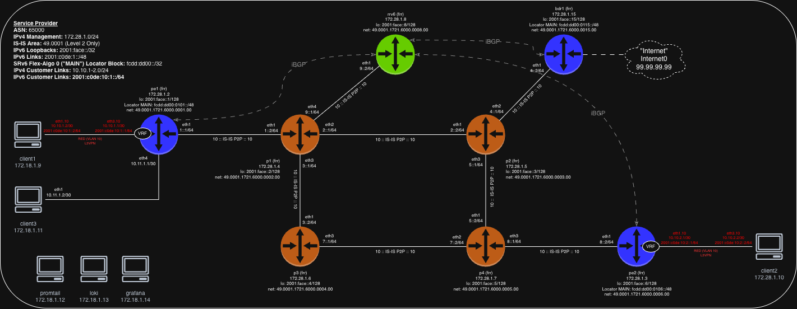

# clab-frr-srv6

## Overview

A Segment Routing IPv6 (SRv6) network using [CONTAINERlab](https://containerlab.dev/) and [FRRouting (FRR)](https://frrouting.org/) nodes to demonstrate [SRv6](https://docs.frrouting.org/en/latest/zebra.html#segment-routing-ipv6) capabilities in a controlled lab environment. This lab provides a practical environment for learning and testing basic SRv6 concepts including locator blocks, SRv6 transport for (IPv4 + IPv6) BGP L3VPN services, and SRv6 functions and behaviors.

## Requirements

- [CONTAINERlab](https://containerlab.dev/install/)
  - _The [CONTAINERlab](https://containerlab.dev/install/) installation guide outlines various installation methods. This lab assumes all [pre-requisites](https://containerlab.dev/install/#pre-requisites) (including Docker) are met and CONTAINERlab is installed via the [install script](https://containerlab.dev/install/#install-script)._
- Docker FRR image: `quay.io/frrouting/frr:10.7.0` (will be downloaded automatically)
- Docker Network Multitool image: `wbitt/network-multitool:alpine-extra` (for client nodes) (will be downloaded automatically)

## Topology



## Network Resources

- The IPv6 loopback addresses are allocated from the 2001:face::/32 subnet and follow the format:
  - 2001:face::y/128, where y is assigned incrementally per device (e.g., 2001:face::1/128 for pe1)
- The IPv6 interface addresses are allocated from the 2001:c0de:1::/48 subnet and follow the format:
  - 2001:c0de:1:y::z/64, where y and z vary per link
- SRv6 uSID locators follow the f3216 (32-bit uSID block + 16-bit Node Identifier) format
- **NOTE: as of release 10.7.0, Flex-Algo is not supported in FRR for SRv6, and thus we are only working with what would technically be Flex-Algo0 (default using SPF). Nonethless, our locator planning schema is taking into account expansion for Flex-Algo support.**
- We will configure Flex-Algo 0 as Locator "MAIN", and will be our working example for the locator schema:
  - fcdd:dd00:01xx::/48, where x is the node identifier (e.g., fcdd:dd00:0101::/48 for pe1)
    - uSID block (32 bits) (fcdd:dd00::/32)
      - Base SRv6 locator prefix (network wide) (24 bits) (fcdd:dd::/24)
      - General use identifier (4 bits) (fcdd:dd0::/28)
      - Flex-Algo identifier (4 bits) (fcdd:dd00::/32)
    - Domain identifier (8 bits) (fcdd:dd00:01::/40)
    - Node identifier (8 bits) (fcdd:dd00:0101::/48)
    - This allows our domain's SRv6 SIDs to be summarized per Flex-Algo at the /40 prefix length
- The router ID's (such as for BGP process) are allocated from a 172.16.0.0/24 block that will not be routed in any context within the IPv6 network:
  - 172.16.0.y/32 where y is assigned incrementally per device (e.g., 172.16.0.1/32 for pe1)
- All routers are part of IS-IS Level 2 with IS-IS NET addresses with the following format, based on the router ID:
  - 49.0001.xxxx.xxxx.xxxx.00 (e.g., 49.0001.1721.6000.0001.00 for pe1)
- BGP is configured on the PEs (pe1, pe2, bdr1) with ASN 65000

### Management Network

The following IP addresses are assigned to the containerLAB nodes for management:

| Node      | Management IP   |
|-----------|----------------|
| pe1       | 172.28.1.2/24  |
| pe2       | 172.28.1.3/24  |
| p1        | 172.28.1.4/24  |
| p2        | 172.28.1.5/24  |
| p3        | 172.28.1.6/24  |
| p4        | 172.28.1.7/24  |
| rrv6      | 172.28.1.8/24  |
| bdr1      | 172.28.1.15/24 |
| c1        | 172.28.1.9/24  |
| c2        | 172.28.1.10/24 |
| c3        | 172.28.1.11/24 |
| promtail  | 172.28.1.12/24 |
| loki      | 172.28.1.13/24 |
| grafana   | 172.28.1.14/24 |

## SRv6-based L3VPN Services

This lab demonstrates SRv6 as a transport for L3VPN services, showcasing how SRv6 can replace traditional MPLS-based transport:

- One single SID is needed
- No new protcol (just BGP)
  - No new SAFI
- Automated
  - No tunnel to configure
- SRv6 for everything
  - No other protocol, just IPv6 with SRv6 (not even SRH required due to use of uSID with reduced encapsulation)

### SRv6 Setup

- **SRv6 Locators**: Each SRv6 particpating router (pe1 and pe2) have a unique SRv6 locator block that serves as the foundation for SRv6 functions
- **uSID Format**: The lab uses micro-segment identifiers (uSID) with block-len 32, node-len 16, func-bits 16 format for efficient segment encoding
- **SRv6 Encapsulation Behavior**: The main BGP process includes `segment-routing srv6` with `locator MAIN` and `encap-behavior H_Encaps_Red` configuration, which defines how VPN traffic is encapsulated into SRv6 packets. The `H_Encaps_Red` behavior specifically indicates that the router performs SRv6 header encapsulation with reduced SRH (Segment Routing Header) for VPN traffic
- **VPN SID Generation**: Both 'per-vrf' and 'per-af' SID configuration is possible to automatically generate SRv6 SIDs for VPN services, however, they are mutually exclusive. In this lab we are using the 'per-af' approach with the `sid vpn export auto` command configured under `address-family ipv4 unicast` and `address-family ipv6 unicast` for the BGP VRF process. Conversely, if we were using the 'per-vrf' approach instead, the command `sid vpn per-vrf export auto` would be configured under each BGP VRF process to automatically generate SRv6 SIDs for VPN services for all address families.

### BGP L3VPN Setup

- **VRF Configuration**: The RED VRF is configured on both PE routers (pe1 and pe2) for IPv4/IPv6 unicast address family.
- **Client Connectivity**: Clients c1 and c2 connect to pe1 and pe2 respectively through VLAN interfaces assigned to the RED VRF.
- **Route Distinguishers**: VRF routes use router-specific RDs and share the same RT, one per VRF.
- **End-to-End Service**: The BGP L3VPN control plane exchanges routes between the VRFs, while SRv6 provides the data plane transport across the network

### Global Table SRv6 Note

The lab also includes a scaffold for a **global/default-table SRv6 routing** use case between `pe1` and `bdr1`. In this example, `pe1` originates the client3-connected subnet `10.11.1.0/30` in the default table, and `bdr1` originates the simulated Internet loopback `99.99.99.99/32` in the default table. The BGP configuration on both routers is set up so that FRR allocates SRv6 SIDs for these global-table routes.

In practice, you should be able to observe the expected SRv6 SID allocation and related control-plane state from the configuration on `pe1/frr.conf` and `bdr1/frr.conf`. However, in the current lab environment, **the actual SRv6 service behavior for the default VRF / global table is not functioning end to end**, even though the equivalent SRv6 VPN behavior for non-default VRFs such as `RED` does work.

Stated differently:

- **Working**: SRv6-based L3VPN service behavior for routes imported into VRF `RED`
- **Not currently working**: SRv6 local service behavior that performs post-decap lookup in the default VRF / global table

This limitation was also observed when bypassing BGP-based global SID export and testing with statically configured SIDs and static SRv6 traffic steering. Packets can be steered correctly across the SRv6 underlay from `pe1` toward `bdr1`, but the expected local behavior tied to the default/global table does not complete successfully on `bdr1`.

For now, treat the global Internet routing over SRv6 portion of the lab as a **control-plane and SID-allocation demonstration**, rather than a fully functioning default-table SRv6 service dataplane example.

## Monitoring

A logging stack is deployed to collect and aggregate logs from the FRR routers and clients. The logging stack is deployed using [CONTAINERlab](https://containerlab.dev/), [Promtail](https://grafana.com/docs/loki/latest/clients/promtail/), [Loki](https://grafana.com/docs/loki/latest/), and [Grafana](https://grafana.com/).

Once the lab is deployed, the logging stack can be accessed at `http://localhost:3000`. Then navigate to the `Network Logs` dashboard.

## Deployment

Clone this repository and start the lab:

```shell
git clone https://github.com/dbono711/clab-frr-srv6.git
cd clab-frr-srv6
sudo clab deploy -t lab.yml
```

**_NOTE: CONTAINERlab requires SUDO privileges in order to execute_**

The deployment process:

- Creates the [CONTAINERlab network](lab.yml) based on the topology definition
- Applies the FRR configuration files from the respective router folders on each node
- Executes the initialization scripts for each router and client

## Accessing the Container Shell

The container shell can be accessed by using the `docker exec` command, as follows:

```shell
docker exec -it <container> bash
```

For example, to access the shell on the `pe1` FRR container:

```shell
docker exec -it clab-frr-srv6-pe1 bash
```

## Accessing the FRR CLI (vtysh)

The FRR CLI can be accessed by using the `docker exec` command, as follows:

```shell
docker exec -it <container> vtysh
```

For example, to access the FRR CLI on the `pe1` container:

```shell
docker exec -it clab-frr-srv6-pe1 vtysh
```

## Capturing Packets

Here is an example on how to capture packets directly on the host which CONTAINERlab is running:

```shell
sudo ip netns exec clab-frr-srv6-pe1 tcpdump -nni eth1
```

## Cleanup

Stop the lab and tear down the CONTAINERlab containers:

```shell
clab destroy -t lab.yml
```

## Author

- Darren Bono - [darren.bono@att.net](mailto://darren.bono@att.net)

## License

This project is licensed under the MIT License. See [LICENSE](LICENSE) for details
