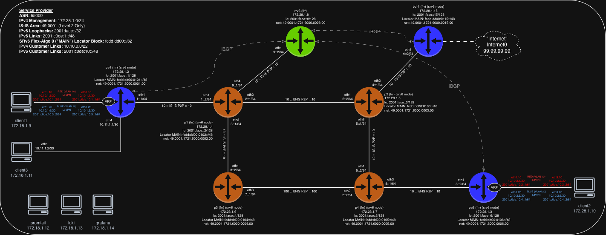

# clab-frr-srv6

## Overview

A Segment Routing IPv6 (SRv6) network using [CONTAINERlab](https://containerlab.dev/) and [FRRouting (FRR)](https://frrouting.org/) nodes to demonstrate [SRv6](https://docs.frrouting.org/en/latest/zebra.html#segment-routing-ipv6) capabilities in a controlled lab environment. This lab provides a practical environment for learning and testing basic SRv6 concepts including locator blocks, SRv6 transport for (IPv4 + IPv6) BGP L3VPN services, and SRv6 functions and behaviors.

## Requirements

- [CONTAINERlab](https://containerlab.dev/install/)
  - _The [CONTAINERlab](https://containerlab.dev/install/) installation guide outlines various installation methods. This lab assumes all [pre-requisites](https://containerlab.dev/install/#pre-requisites) (including Docker) are met and CONTAINERlab is installed via the [install script](https://containerlab.dev/install/#install-script)._
- Docker FRR image: `quay.io/frrouting/frr:10.7.0` (will be downloaded automatically)
- Docker Network Multitool image: `wbitt/network-multitool:alpine-extra` (for client nodes) (will be downloaded automatically)

## Topology



## Network Resources

- The IPv6 loopback addresses are allocated from the 2001:face::/32 subnet and follow the format:
  - 2001:face::y/128, where y is assigned incrementally per device (e.g., 2001:face::1/128 for pe1)
- The IPv6 interface addresses are allocated from the 2001:c0de:1::/48 subnet and follow the format:
  - 2001:c0de:1:y::z/64, where y and z vary per link
- SRv6 uSID locators follow the f3216 (32-bit uSID block + 16-bit Node Identifier) format
- **NOTE: as of release 10.7.0, Flex-Algo is not supported in FRR for SRv6, and thus we are only working with what would technically be Flex-Algo 0 (default using SPF/IGP Metric). Nonethless, our locator schema is taking into account expansion for Flex-Algo support.**
- We will configure Flex-Algo 0 as Locator "MAIN", and will be our working example for the locator schema:
  - fcdd:dd00:01xx::/48, where x is the node identifier (e.g., fcdd:dd00:0101::/48 for pe1)
    - uSID block (32 bits) (fcdd:dd00::/32)
      - Base SRv6 locator prefix (network wide) (24 bits) (fcdd:dd::/24)
      - General use identifier (4 bits) (fcdd:dd0::/28)
      - Flex-Algo identifier (4 bits) (fcdd:dd00::/32)
    - Domain identifier (8 bits) (fcdd:dd00:01::/40)
    - Node identifier (8 bits) (fcdd:dd00:0101::/48)
    - This allows our domain's SRv6 SIDs to be summarized per Flex-Algo at the /40 prefix length
- The router ID's (such as for BGP process) are allocated from a 172.16.0.0/24 block that will not be routed in any context within the IPv6 network:
  - 172.16.0.y/32 where y is assigned incrementally per device (e.g., 172.16.0.1/32 for pe1)
- All routers are part of IS-IS Level 2 with IS-IS NET addresses with the following format, based on the router ID:
  - 49.0001.xxxx.xxxx.xxxx.00 (e.g., 49.0001.1721.6000.0001.00 for pe1)
- BGP is configured on the PEs (pe1, pe2, bdr1) with ASN 65000

### Management Network

The following IP addresses are assigned to the containerLAB nodes for management:

| Node      | Management IP   |
|-----------|----------------|
| pe1       | 172.28.1.2/24  |
| pe2       | 172.28.1.3/24  |
| p1        | 172.28.1.4/24  |
| p2        | 172.28.1.5/24  |
| p3        | 172.28.1.6/24  |
| p4        | 172.28.1.7/24  |
| rrv6      | 172.28.1.8/24  |
| bdr1      | 172.28.1.15/24 |
| c1        | 172.28.1.9/24  |
| c2        | 172.28.1.10/24 |
| c3        | 172.28.1.11/24 |
| promtail  | 172.28.1.12/24 |
| loki      | 172.28.1.13/24 |
| grafana   | 172.28.1.14/24 |

## SRv6-based L3VPN Services

This lab demonstrates SRv6 as a transport for L3VPN services, showcasing how SRv6 can replace traditional MPLS-based transport:

- One single SID is needed
- No new protcol (just BGP)
  - No new SAFI
- Automated
  - No tunnel to configure
- SRv6 for everything
  - No other protocol, just IPv6 with SRv6 (not even SRH required due to use of uSID with reduced encapsulation)

### SRv6 Setup

- **SRv6 Locators**: Each SRv6 particpating router (pe1 and pe2) have a unique SRv6 locator block that serves as the foundation for SRv6 functions
- **uSID Format**: The lab uses micro-segment identifiers (uSID) with block-len 32, node-len 16, func-bits 16 format for efficient segment encoding
- **SRv6 Encapsulation Behavior**: The main BGP process includes `segment-routing srv6` with `locator MAIN` and `encap-behavior H_Encaps_Red` configuration, which defines how VPN traffic is encapsulated into SRv6 packets. The `H_Encaps_Red` behavior specifically indicates that the router performs SRv6 header encapsulation with reduced SRH (Segment Routing Header) for VPN traffic
- **BGP VPN SID Generation**: Both 'per-vrf' (generates a SID per VRF covering uDT46 behavior for both IPv4 and IPv6 address families) and 'per-af' (generates a SID per address family for uDT4 and uDT6 behavior respectively) SID configuration is possible to automatically generate SRv6 SIDs for VPN services, however, they are mutually exclusive. In this lab we are using the 'per-vrf' approach with the `sid vpn per-vrf export auto` command configured under each BGP VRF process to automatically generate SRv6 SIDs for VPN services for all address families. Conversely, if we were using the 'per-af' approach instead, the `sid vpn export auto` command would be configured under `address-family ipv4 unicast` and `address-family ipv6 unicast` for the BGP VRF process.

The following table documents the intended Flex-Algo-to-locator mapping for future expansion. At present, FRR SRv6 support in this lab is limited to Flex-Algo `0`, and FRR cannot yet advertise more than one SRv6 locator in IS-IS. This table is therefore a planning reference for the locator schema rather than a fully implemented feature set.

| Flex-Algo | Metric Type | Link Affinity / Color | Participating Nodes | Locator | Description |
|-----------|-------------|-----------------------|---------------------|---------|-------------|
| 0 | IGP metric / SPF | None | `pe1`, `pe2`, `p1`, `p2`, `p3`, `p4`, `rrv6`, `bdr1` | `MAIN` (`fcdd:dd00:01xx::/48`) | Default underlay computation and the only SRv6 locator model currently implemented in FRR for this topology. |

### BGP L3VPN Setup

- **VRF Configuration**: The RED and BLUE VRFs are configured on both PE routers (pe1 and pe2) for IPv4/IPv6 unicast address family.
- **Client Connectivity**: Clients c1 and c2 connect to pe1 and pe2 respectively through VLAN interfaces assigned to both VRFs: VLAN 10 for RED and VLAN 20 for BLUE.
- **Route Distinguishers and Route Targets**: Each VRF uses router-specific RDs and a shared RT per VRF across the PEs. In this lab, RED uses `*:10` / `65000:10`, and BLUE uses `*:20` / `65000:20`.
- **Per-VRF SRv6 Service Model**: Each VRF BGP process uses `sid vpn per-vrf export auto`, which allocates one SRv6 VPN service SID per VRF covering both IPv4 and IPv6 address families.
- **End-to-End Service**: The BGP L3VPN control plane exchanges routes between matching VRFs on the PEs, while SRv6 provides the data plane transport across the network.

### Global Table SRv6 Note

The lab also includes a scaffold for a **global/default-table SRv6 routing** use case between `pe1` and `bdr1`. In this example, `pe1` originates the client3-connected subnet `10.11.1.0/30` in the default table, and `bdr1` originates the simulated Internet loopback `99.99.99.99/32` in the default table. The BGP configuration on both routers is set up so that FRR allocates SRv6 SIDs for these global-table routes.

In practice, you should be able to observe the expected SRv6 SID allocation and related control-plane state from the configuration on `pe1/frr.conf` and `bdr1/frr.conf`. However, in the current lab environment, **the actual SRv6 service behavior for the 'default' VRF / global table is not functioning end to end**.

Stated differently:

- **Working**: SRv6-based L3VPN service behavior for routes imported into VRFs such as `RED` and `BLUE`
- **Not currently working**: SRv6 local service behavior that performs post-decap lookup in the default VRF / global table

This limitation was also observed when bypassing BGP-based global SID export and testing with statically configured SIDs and static SRv6 traffic steering. Packets can be steered correctly across the SRv6 underlay from `pe1` toward `bdr1`, but the expected local behavior tied to the default/global table does not complete successfully on `bdr1`.

Based on the current zebra/kernel error output, a likely root cause is that FRR's SRv6 local-service install path expects the target routing table to have an associated Linux VRF device. That assumption works for non-default VRFs such as `RED` and `BLUE`, but appears to fail for the global table (`vrf 0`, table `254`), which does not have a corresponding VRF device.

For now, treat the global Internet routing over SRv6 portion of the lab as a **control-plane and SID-allocation demonstration**, rather than a fully functioning default-table SRv6 service dataplane example.

## Manual SRv6 Traffic Steering (No BGP Overlay)

The RED and BLUE services above rely on a BGP L3VPN overlay: the PEs learn each other's prefixes through the route reflector, FRR auto-allocates the service SID, and the path the traffic takes across the core is whatever IS-IS SPF happens to choose. This is a great model for production (sans anything advanced such as ODN or SR-TE policy or other FlexAlgo's), but you never get to see the segment list, and you cannot choose the path.

[`scripts/srv6_pseudo_controller.py`](scripts/srv6_pseudo_controller.py) exists to expose that mechanism. It is a standalone operator tool (not part of the deployed topology, and not started by `clab deploy`) that provisions an additional VRF service against an already-running lab with **no BGP involvement at all**:

- **No overlay control plane.** Nothing is advertised and nothing is learned. Both PEs get a statically configured SID and a static route.
- **The operator picks the path.** Rather than accepting the SPF result, you select the exact sequence of P routers the traffic will traverse, and those hops are encoded directly into a uSID segment list.
- **Forward and reverse paths are chosen independently**, so asymmetric routing is a single menu selection away.

The only thing still doing work underneath is IS-IS, which distributes each node's `/48` locator so that plain IPv6 longest-prefix-match forwarding can carry the packet from hop to hop. That is the point of the exercise: SRv6 transport needs an IGP and nothing else.

### Running it

The lab must already be deployed. The script is pure Python 3 standard library — no `pip install`, no virtualenv:

```shell
python3 scripts/srv6_pseudo_controller.py --dry-run
```

It probes both PEs for what is already in use, then interviews you for a VRF name, a VLAN ID, an address-family mode, whether to use `H_Encaps_Red`, and the forward and reverse core paths. The Linux VRF table ID, the SID function, and the IPv4 `/30` and IPv6 `/64` subnet pairs are allocated automatically from the free space, so a new service cannot collide with RED, BLUE, or a service you created earlier.

Because the topology only lets `pe1` reach `p1` and `pe2` reach `p4`, there are exactly two paths in each direction, and they are offered as a menu rather than typed:

```text
Forward transit path from pe1 to pe2
  1) p1,p2,p4 (default)
  2) p1,p3,p4
Select [1-2]:
```

Answer `--dry-run` (or `y` at the "Dry run only?" prompt) and the tool prints every `ip` and `vtysh` command it would issue, annotated by node, without touching anything. Answer `n` and it applies them to `pe1`, `pe2`, `c1` and `c2` in order.

A first service on a freshly deployed lab resolves like this:

```text
=== Service Summary ===
VRF: GREEN
VLAN: 30
AF mode: dual
VRF table: 30
SID function: fe00
PE1 IPv4 subnet: 10.10.1.8/30
PE2 IPv4 subnet: 10.10.2.8/30
PE1 IPv6 subnet: 2001:c0de:10:5::/64
PE2 IPv6 subnet: 2001:c0de:10:6::/64
Forward core nodes: p1,p2,p4
Reverse core nodes: p4,p3,p1
Forward segment: fcdd:dd00:102:103:105:106:fe00::
Reverse segment: fcdd:dd00:105:104:102:101:fe00::
```

The two commands that make the steering happen are a static SID on the egress PE and a static route on the ingress PE:

```text
sid fcdd:dd00:101:fe00::/64 locator MAIN behavior uDT46 vrf GREEN
ip route 10.10.2.8/30 sr0 vrf GREEN segments fcdd:dd00:102:103:105:106:fe00:: nexthop-vrf default
```

Note that `segments` takes a **single** value. With uSID, one IPv6 address is the entire segment list.

### Shift-and-Forward: How the Packet Crosses the Core

Take the forward segment from the example above:

```text
fcdd:dd00:102:103:105:106:fe00::
```

Written out as its eight 16-bit groups, that address is not an address in the ordinary sense — it is a **uSID carrier**, a container holding the whole path:

| Bits | Value | Meaning |
|------|-------|---------|
| 0-31 | `fcdd:dd00` | uSID block, common to the whole domain |
| 32-47 | `0102` | `p1` |
| 48-63 | `0103` | `p2` |
| 64-79 | `0105` | `p4` |
| 80-95 | `0106` | `pe2` |
| 96-111 | `fe00` | the `uDT46` service function on `pe2` |
| 112-127 | `0000` | end of carrier (unused slot) |

`pe1` does not appear in the list, because `pe1` is the node doing the encapsulation. After the 32-bit block there are six 16-bit slots, so up to six uSIDs fit in a single address (this path uses five and leaves one empty).

When `c1` sends a packet to `10.10.2.10`, `pe1` matches the static route, pushes an outer IPv6 header with that carrier as the destination address, and forwards. Each core node then performs the **uN (shift-and-forward)** behavior. It recognizes the active uSID as its own, **shifts the remaining uSIDs 16 bits to the left**, zero-fills on the right, and forwards on a normal IPv6 lookup of the new destination:

| Node | Destination address on arrival | Active uSID | Action | Destination address on departure |
|------|-------------------------------|-------------|--------|----------------------------------|
| `pe1` | *(inner packet from `c1`)* | — | Encapsulate: push outer IPv6 header | `fcdd:dd00:102:103:105:106:fe00::` |
| `p1` | `fcdd:dd00:102:103:105:106:fe00::` | `0102` (self) | uN: shift left, forward toward `0103` | `fcdd:dd00:103:105:106:fe00::` |
| `p2` | `fcdd:dd00:103:105:106:fe00::` | `0103` (self) | uN: shift left, forward toward `0105` | `fcdd:dd00:105:106:fe00::` |
| `p4` | `fcdd:dd00:105:106:fe00::` | `0105` (self) | uN: shift left, forward toward `0106` | `fcdd:dd00:106:fe00::` |
| `pe2` | `fcdd:dd00:106:fe00::` | `0106` (self), then `fe00` | `uDT46`: decapsulate, look up the inner packet in VRF `GREEN` | *(inner packet to `c2`)* |

Three things are worth drawing out:

- **There is no Segment Routing Header.** The entire path travels in the 128-bit destination address. This is what the overview means by "not even SRH required due to use of uSID with reduced encapsulation" — for six hops or fewer, the address *is* the segment list, and the packet carries no SR extension header at all.
- **Every transit lookup is ordinary IPv6 forwarding.** `p1`, `p2` and `p4` hold no per-path state, no tunnel, and no signaling session. They match `fcdd:dd00:103::/48` in the IS-IS-learned routing table exactly as they would any other prefix. The path is state in the *packet*, not in the network.
- **The last uSID is a function, not a node.** `fe00` is not a router; it is a local instruction on `pe2`, bound by the `static-sids` stanza to `uDT46` and VRF `GREEN`. Reaching it is what tells `pe2` to strip the outer header and resolve the inner packet in that VRF's table.

### Watching It Happen

Because the destination address is rewritten at every hop, the shift is directly observable on the wire. `p2` connects to `p4` on `eth3` (see `lab.yml`), so capturing there shows the carrier already shortened by two uSIDs:

```shell
sudo ip netns exec clab-frr-srv6-p2 tcpdump -nni eth3 ip6
```

Generate traffic from `c1` on the new service and you should see the outer destination as `fcdd:dd00:105:106:fe00::` — `0102` and `0103` consumed by `p1` and `p2` respectively:

```shell
docker exec -it clab-frr-srv6-c1 ping -c 5 10.10.2.10
```

To confirm the control-plane and forwarding state on the PEs themselves, follow the same pattern used in [ROUTE-EXPORT-VALIDATION.md](ROUTE-EXPORT-VALIDATION.md), checking that the route installs in the VRF with the expected `seg6` encapsulation:

```shell
docker exec -it clab-frr-srv6-pe1 vtysh -c "show ip route vrf GREEN 10.10.2.8/30 json"
docker exec -it clab-frr-srv6-pe2 vtysh -c "show segment-routing srv6 sid"
```

## Monitoring

A logging stack is deployed to collect and aggregate logs from the FRR routers and clients. The logging stack is deployed using [CONTAINERlab](https://containerlab.dev/), [Promtail](https://grafana.com/docs/loki/latest/clients/promtail/), [Loki](https://grafana.com/docs/loki/latest/), and [Grafana](https://grafana.com/).

Once the lab is deployed, the logging stack can be accessed at `http://localhost:3000`. Then navigate to the `Network Logs` dashboard.

## Deployment

Clone this repository and start the lab:

```shell
git clone https://github.com/dbono711/clab-frr-srv6.git
cd clab-frr-srv6
sudo clab deploy -t lab.yml
```

**_NOTE: CONTAINERlab requires SUDO privileges in order to execute_**

The deployment process:

- Creates the [CONTAINERlab network](lab.yml) based on the topology definition
- Applies the FRR configuration files from the respective router folders on each node
- Executes the initialization scripts for each router and client

## Accessing the Container Shell

The container shell can be accessed by using the `docker exec` command, as follows:

```shell
docker exec -it <container> bash
```

For example, to access the shell on the `pe1` FRR container:

```shell
docker exec -it clab-frr-srv6-pe1 bash
```

## Accessing the FRR CLI (vtysh)

The FRR CLI can be accessed by using the `docker exec` command, as follows:

```shell
docker exec -it <container> vtysh
```

For example, to access the FRR CLI on the `pe1` container:

```shell
docker exec -it clab-frr-srv6-pe1 vtysh
```

## Capturing Packets

Here is an example on how to capture packets directly on the host which CONTAINERlab is running:

```shell
sudo ip netns exec clab-frr-srv6-pe1 tcpdump -nni eth1
```

## Cleanup

Stop the lab and tear down the CONTAINERlab containers:

```shell
clab destroy -t lab.yml
```

## Author

- Darren Bono - [darren.bono@att.net](mailto://darren.bono@att.net)

## License

This project is licensed under the MIT License. See [LICENSE](LICENSE) for details
